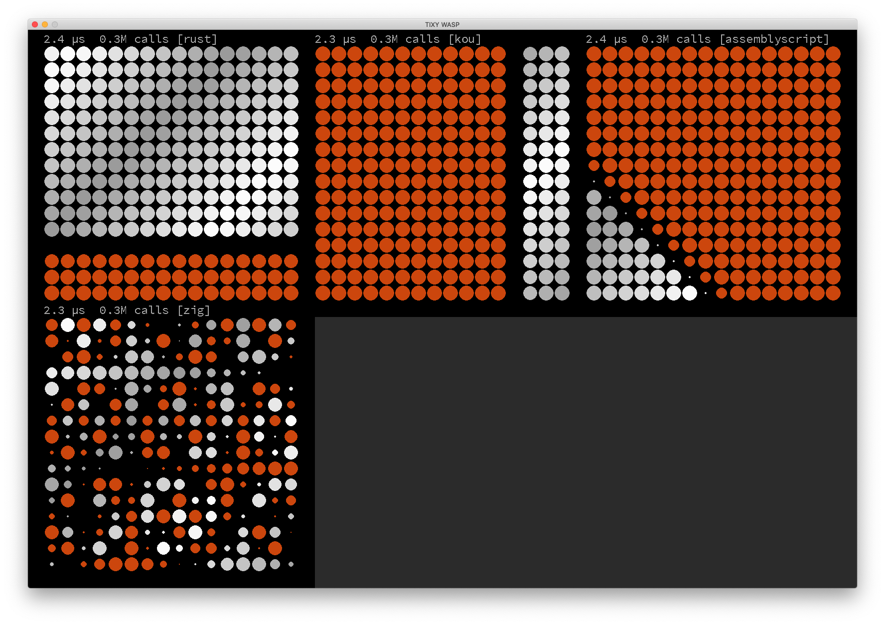
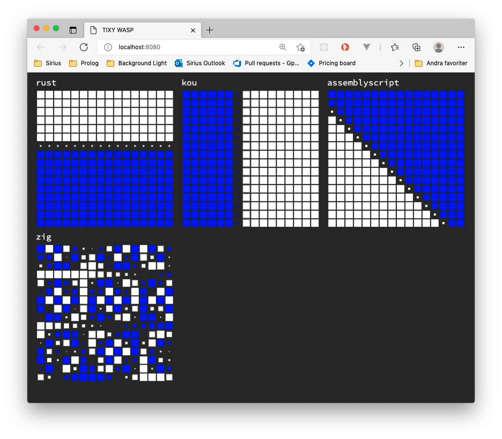

# tixy-wasp
This repo re-implements https://tixy.land/ in Python, using a WebAssembly function to drive the animations.

The main purpose is showing Wasm-integration from multiple languages, and tixy is just a so much more playful demonstration than some boring `add(x, y)` test.

# Run locally with python

    git clone https://github.com/marhel/tixy-wasp
    cd tixy-wasp
    python3 -m venv venv
    source ./venv/bin/activate # may be different on Windows
    pip3 install -r requirements.txt
    python3 main.py

The following keys can be used in the application:
* enter - reset time
* spacebar - switch to a different color
* escape - exit



# Run locally in the browser

    git clone https://github.com/marhel/tixy-wasp
    cd tixy-wasp
    python3 -m http.server 8080

Then open http://localhost:8080 in browser. This version deos not show any
performance measurements due to trying to measure tiny timespans and
the timer resolution in browsers is currently intentionally unreliable
(due to Spectre mitigations).



# The tixy function
The required tixy function has the signature `float int int int -> float` which is
`float tixy(float t, int i, int x, int y)` in C syntax.

* t is the time since start in fractional seconds, so t is unsurprisingly 2.4 after 2.4 seconds.
* i is the index (one more for each dot) so for a 32 x 32 grid, i is 0-1023.
* x and y are the coordinates of the dot.

The return value determines the look of the dot at the given coordinates. A negative value is colored, a positive value is white.
The magnitude determines the size of the dot (capped at -1.0 to 1.0).

So -1.0 is a big colored dot. 1.0 is a big white dot. -0.2 is a small colored dot. Zero is "black" (due to zero radius).
14.2 is the same size and color as 1.0 due to capping.

Go to https://tixy.land to see some example functions, and it's possibly quicker to experiment there as well.

# Add another language
Add a script `lang/some_lang/compile.sh` that does whatever it takes to compile your tixy function producing a `lang/some_lang/tixy.wasm` file with this function exported.
See the pre-existing immplementations under the lang folder.

Then edit main.py and add a TixyHandler for your wasm file, and replace one of the pre-existing duplicate renderings with your own.

```python
# this assumes that your .wasm file exports a "tixy" function with the proper signature
some_lang = TixyHandler('some_lang', 'langs/some_lang/tixy.wasm')
...
screen.blit(render(some_lang), square[3])
```

To include in the JavaScript version, edit main.js and add your language and wasm file:

```javascript
var some_lang = await CreateTixyHandler('some_lang', 'langs/some_lang/tixy.wasm')
...
ctx.drawImage(render(some_lang), ... square[3])
```

Then submit this as a PR, including the tixy.wasm-file to help those that haven't yet installed the (wasm-)toolchain for your language.
